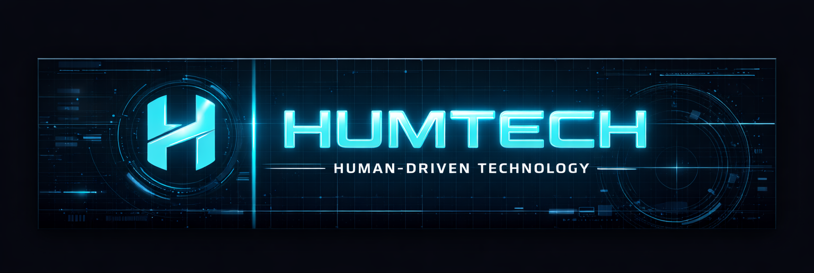
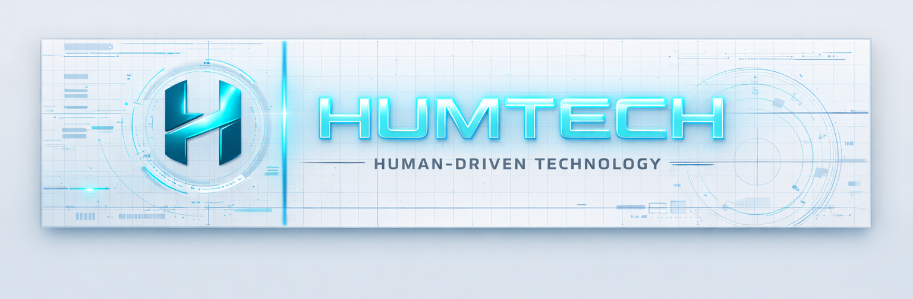

# 🌐 HumTech — Human‑Driven Technology

Welkom op mijn GitHub‑profiel.  
Ik bouw aan Human‑Driven Technology: slimme automations, dashboards, Home Assistant‑integraties en een consistente visuele identiteit voor mijn HumTech‑ecosysteem.

---

## 🖼️ HumTech Header

---

## 🧑‍💻 Over mij
- Alwin Hummels — Dordrecht, Nederland
- Home Assistant enthousiast, automations‑bouwer en HumLab/HumTech creator
- Focus op cleane UI, slimme workflows en consistente branding

---

## 🏷️ HumTech‑Badges

---

## 🚀 Waar ik aan werk
- Automations voor Home Assistant
- HumLab dashboards
- HumTech branding & UI
- Integraties & tooling

---

## 📦 Populaire repositories
- HA‑Animated‑cards
- Home Assistant config
- Zeus icon set
- BSEC‑Conduit

---

## 🎨 HumTech Stijlrichtlijnen
- Blauw‑grijs basis (#2C3E50)
- Cyan glow (#00FFFF)
- Donker night‑mode (#0A0F1C)
- Inter / Roboto Mono
- Minimalistisch, clean, consistent

---

## 🤝 Samenwerken
Pull requests zijn welkom.  
Ik denk graag mee over automations, dashboards en branding.

---

## 📫 Contact
alwin@hummels.tech  
Dordrecht, Nederland
